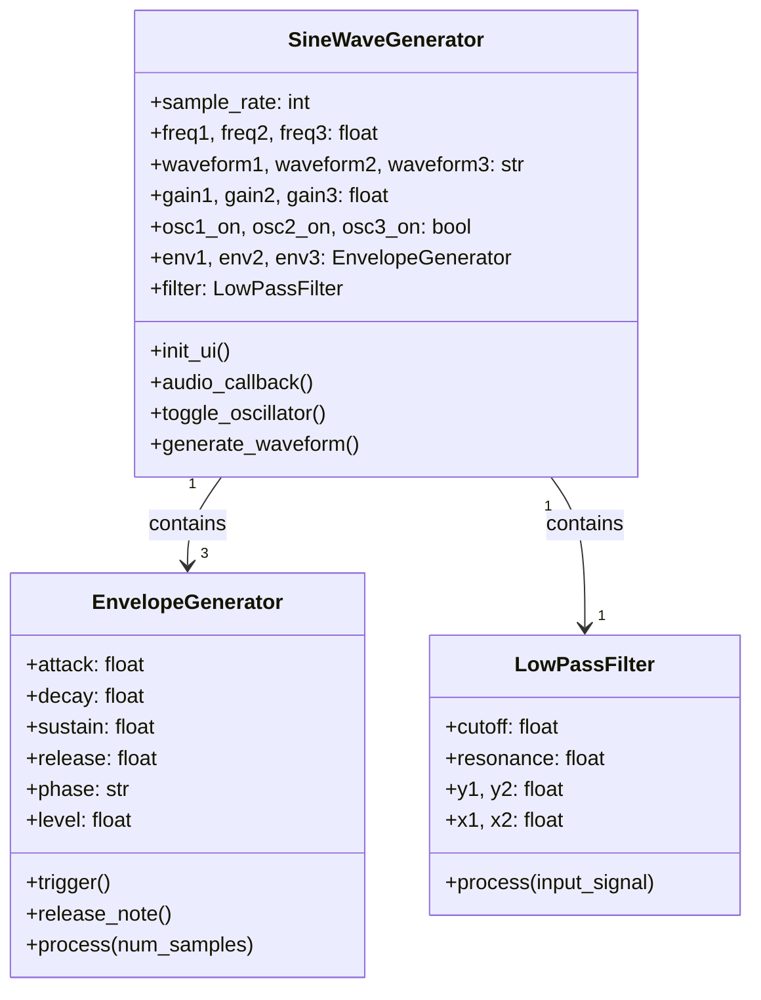
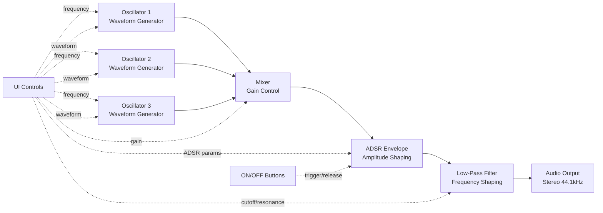
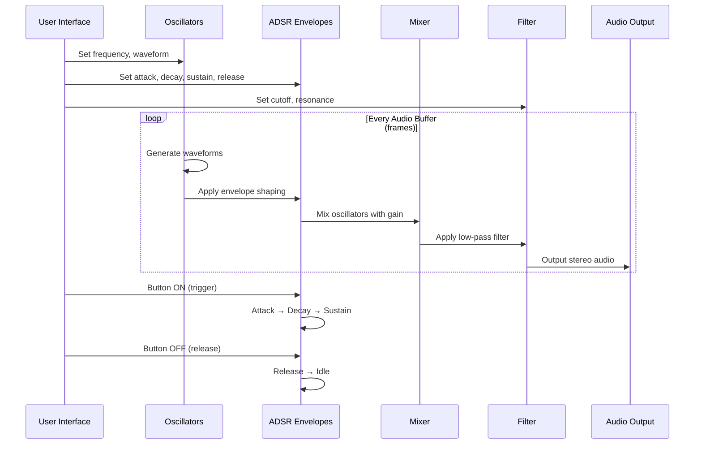

# Triple Oscillator Synth

A professional-grade subtractive synthesizer built with Python and PyQt5. Features three independent oscillators with multiple waveforms, ADSR envelope shaping, and a resonant low-pass filter.


## Features

### Oscillators
- **3 Independent Oscillators**
- **3 Waveforms per Oscillator**:
  - Sine: Pure, smooth tones
  - Sawtooth: Bright, buzzy sounds
  - Square: Hollow, clarinet-like tones
- **Frequency Range**: 20 Hz to 5000 Hz (logarithmic scale)
- **Real-time Frequency Adjustment**: Smooth frequency changes without clicks
- **Individual On/Off Controls**: Per-oscillator activation with visual feedback

### Mixer
- **3-Channel Mixer**: Independent volume control (0-100%) for each oscillator
- **Real-time Mixing**: Adjust oscillator levels on the fly

### ADSR Envelope Generator
- **Attack**: 0-2000ms - Control how quickly the sound fades in
- **Decay**: 0-2000ms - Control how quickly it drops to sustain level
- **Sustain**: 0-100% - Set the held level
- **Release**: 0-5000ms - Control fade-out time after note off
- **Per-Oscillator Envelopes**: Each oscillator has its own independent envelope

### Low-Pass Filter
- **Cutoff Frequency**: 20-5000 Hz - Remove frequencies above the cutoff
- **Resonance**: 0-100% - Emphasize the cutoff frequency for character
- **Biquad Filter Design**: Professional-quality filtering

### Audio Engine
- **44.1 kHz Sample Rate**: CD-quality audio
- **Phase-Continuous Generation**: Click-free frequency changes
- **Real-time Processing**: Low-latency audio synthesis

## Installation

### Prerequisites
- Python 3.7 or higher
- pip (Python package manager)

### Setup

1. Clone the repository:
```bash
git clone https://github.com/yourusername/sine-synth.git
cd sine-synth
```

2. Create a virtual environment:
```bash
python3 -m venv venv
source venv/bin/activate  # On Windows: venv\Scripts\activate
```

3. Install dependencies:
```bash
pip install -r requirements.txt
```

## Usage

Run the synthesizer:
```bash
python sine_generator_qt.py
```

### Creating Sounds

**Pluck Sound:**
- Attack: 5ms, Decay: 200ms, Sustain: 0%, Release: 100ms
- Cutoff: 2000 Hz, Resonance: 0%
- Oscillator 1: Square wave
- Click ON button to trigger a pluck sound

**Pad Sound:**
- Attack: 800ms, Decay: 500ms, Sustain: 60%, Release: 1500ms
- Cutoff: 1500 Hz, Resonance: 30%
- Oscillators 1-3: All Sine waves, slightly detuned (e.g., 440, 442, 444 Hz)
- Creates a lush, evolving pad

**Bass Sound:**
- Attack: 1ms, Decay: 300ms, Sustain: 40%, Release: 200ms
- Cutoff: 400 Hz, Resonance: 10%
- Oscillator 1: Sawtooth @ 110 Hz
- Fat, punchy bass tone

**Detune Effect:**
- Set 2-3 oscillators to slightly different frequencies (e.g., 440, 442, 444 Hz)
- Creates a chorus/detuned effect with natural beating

## Architecture

### Code Architecture



### Signal Flow



### Audio Processing Flow



### Components

**Oscillator**
- Generates waveforms using phase accumulation
- Maintains phase continuity across frequency changes
- Supports sine, sawtooth, and square waveforms

**ADSR Envelope**
- State machine with 5 phases: idle, attack, decay, sustain, release
- Linear interpolation between envelope stages
- Independent envelope per oscillator

**Low-Pass Filter**
- Biquad (2-pole) IIR filter design
- Adjustable cutoff frequency and resonance (Q factor)
- Stable and efficient implementation

## Project Structure

```
sine-synth/
├── sine_generator_qt.py    # Main synthesizer application
├── sine_generator.py        # Legacy tkinter version
├── requirements.txt         # Python dependencies
├── README.md               # This file
└── venv/                   # Virtual environment (not in repo)
```

## Requirements

- Python 3.7+
- numpy >= 1.20.0
- sounddevice >= 0.4.5
- PyQt5 >= 5.15.0

## Development Journey

This project started as a simple sine wave generator and evolved into a full subtractive synthesizer. Key milestones:

1. **Initial Implementation**: Single sine wave oscillator with tkinter GUI
2. **PyQt5 Migration**: Professional GUI with QDial controls
3. **Multiple Oscillators**: Expanded to 3 oscillators with waveform selection
4. **ADSR Envelope**: Added amplitude envelope shaping
5. **Filter**: Implemented resonant low-pass filter

## Roadmap

Future enhancements:
- [ ] MIDI input support for playing with a keyboard
- [ ] Octave switches for easier musical note selection
- [ ] LFO (Low-Frequency Oscillator) for modulation
- [ ] Additional filter types (high-pass, band-pass)
- [ ] Effects (reverb, delay, distortion)
- [ ] Preset management (save/load patches)
- [ ] VST plugin export

## License

MIT License - feel free to use and modify!

## Credits

Built as a learning project exploring audio synthesis, in majority vibecoded using Claude code.
