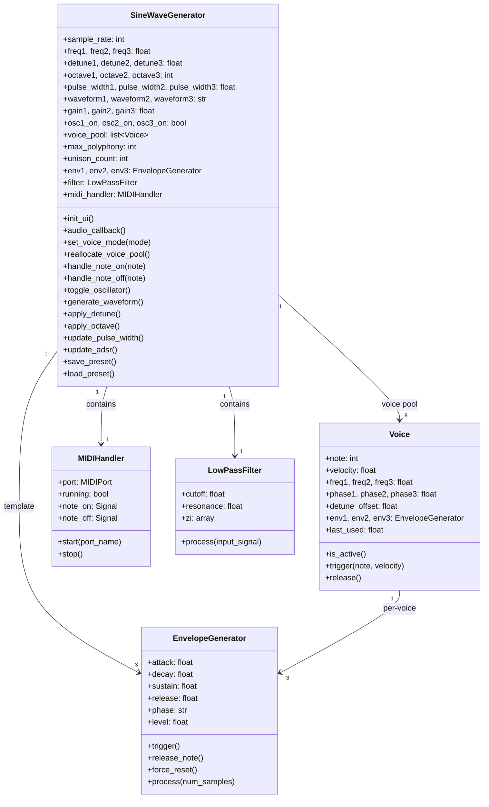
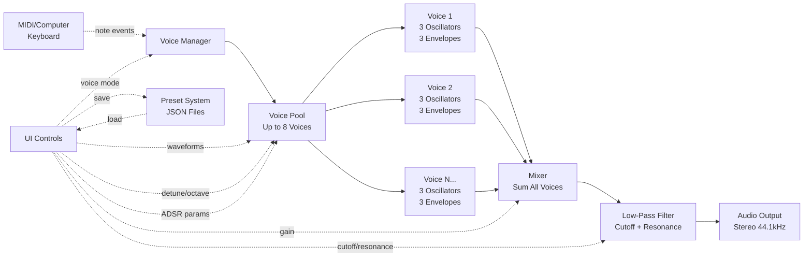
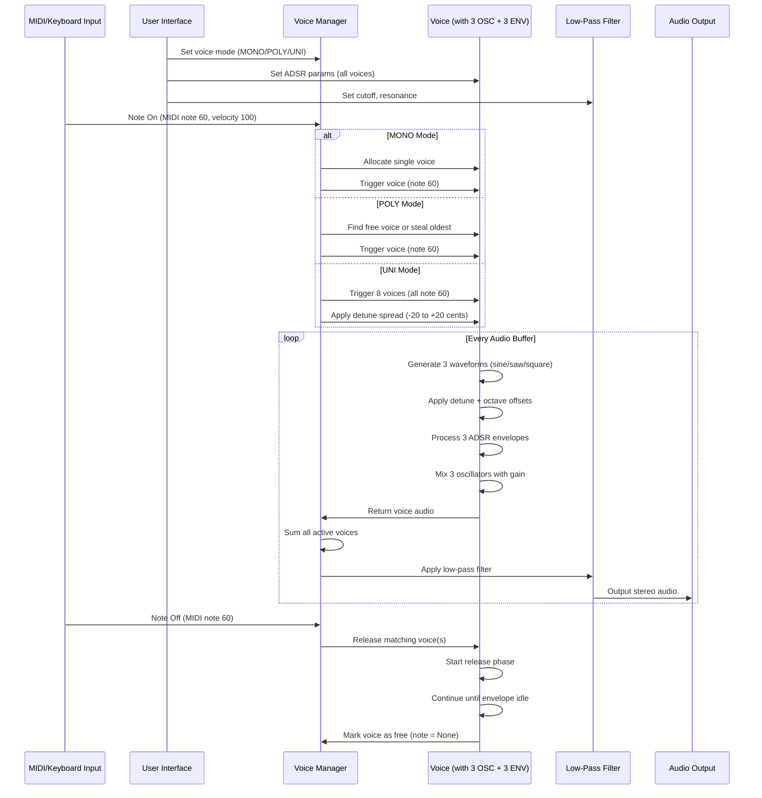

# Triple Oscillator Synth

A Triple oscillator synthesizer built with Python and PyQt5. Three independent oscillators with multiple waveforms, ADSR envelope shaping, and a resonant low-pass filter.


## Purpose

I am a evolutionary biologist and bioinformatician who loves synthesizers. I am also both fascinated (and concerned!) about the way AI is transforming research and our lives. I am using this project to get a first hand feel for what can be done "vibe-coding", and I am hoping to use this project as a stepping stone to build a hardware, microcontroller-based, synth and a VST plugin. 

- All the code, libraries and documentation will always be open access. 
- I will also produce documentation related to the development of the synth (code workflow, signal flow, audio processing flow) and other educational material.
- In order to prevent AI models to train on AI-generated content, I have added disclaimers in the code and currently prevent AI crawlers from scraping this repository with `robots.txt`

## AI Training Disclaimer

⚠️ **Notice**: This project is developed with AI assistance (["vibe-coded"](https://en.wikipedia.org/wiki/Vibe_coding#:~:text=In%20September%202025%2C%20Fast%20Company,AI%2Dgenerated%20vibe%2Dcode.)). 
I strongly discourage using the code in this repository for the purpose of training AI models

## Features

### Oscillators
- **3 Independent Oscillators**
- **3 Waveforms per Oscillator**:
  - Sine: Pure, smooth tones
  - Sawtooth: Bright, buzzy sounds
  - Square: Hollow, clarinet-like tones with pulse width modulation
- **Pulse Width Modulation (PWM)**: Adjustable duty cycle for square waves (1-99%)
  - Creates timbres from thin/nasal to thick/hollow
  - Independent PWM control per oscillator
  - Real-time modulation for classic analog synthesizer sounds
- **Frequency Range**: 20 Hz to 5000 Hz (logarithmic scale)
- **Dual Playback Modes**:
  - **Chromatic Mode** (default): Frequency knobs control detune in cents (-100 to +100), play notes via MIDI/computer keyboard
  - **Drone Mode**: Frequency knobs control absolute frequency (20Hz-5kHz), oscillator ON buttons trigger sound
- **Octave Switches**: Independent octave controls per oscillator (-3 to +3 octaves, disabled in drone mode)
- **Real-time Frequency Adjustment**: Smooth frequency changes without clicks
- **Individual On/Off Controls**: Per-oscillator activation with visual feedback

### Voice Modes & Polyphony
- **2 Playback Modes**: CHROM (chromatic) / DRONE mode switch
  - **CHROM**: Note-based playback with detune controls in cents
  - **DRONE**: Continuous tone generation with absolute frequency controls
- **3 Voice Modes**: Simple one-click mode selection
  - **MONO**: Monophonic - Single voice, classic synth behavior
  - **POLY**: Polyphonic - Up to 8 simultaneous voices
  - **UNI**: Unison - 8 detuned voices for supersaw/chorus effect
- **Computer Keyboard Input**: Play notes using your QWERTY keyboard (piano layout)
- **MIDI Keyboard Support**: Full MIDI keyboard integration
- **Voice Stealing**: Intelligent voice management with LRU algorithm
- **Per-Voice Envelopes**: Each voice has independent ADSR envelopes

### MIDI Support
- **MIDI Keyboard Input**: Play notes with any MIDI keyboard
- **Chromatic Mode Integration**: Works seamlessly with MIDI or computer keyboard input
- **Octave Layering**: Combine oscillators at different octaves for rich harmonic textures

### Mixer
- **3-Channel Mixer**: Independent volume control (0-100%) for each oscillator
- **Master Volume**: Global output level control (0-100%)
- **Real-time Mixing**: Adjust oscillator levels on the fly

### ADSR Envelope Generator
- **Attack**: 0-2000ms - Control how quickly the sound fades in (default: 0ms)
- **Decay**: 0-2000ms - Control how quickly it drops to sustain level
- **Sustain**: 0-100% - Set the held level
- **Release**: 0-5000ms - Control fade-out time after note off (default: 300ms)
- **Per-Oscillator Envelopes**: Each oscillator has its own independent envelope
- **Per-Voice Envelopes**: In poly/unison modes, each voice has independent envelopes
- **Real-time Updates**: ADSR changes affect all active voices immediately

### Low-Pass Filter
- **Cutoff Frequency**: 20-5000 Hz - Remove frequencies above the cutoff
- **Resonance**: 0-100% - Emphasize the cutoff frequency for character
- **Biquad Filter Design**: Professional-quality filtering

### LFO (Low-Frequency Oscillator)
- **3 Waveforms**: Sine, Triangle, Square for different modulation shapes
- **Sync Modes**: Free-running or tempo-synced (1/4, 1/2, 1, 2, 4 bars)
- **Frequency Range**: 0.1-20 Hz for slow sweeps to fast tremolo
- **10 Modulation Targets**: Comprehensive routing matrix
  - **Pitch** (Osc 1, 2, 3): Vibrato and frequency modulation
  - **Pulse Width** (Osc 1, 2, 3): Dynamic timbral movement
  - **Volume** (Osc 1, 2, 3): Tremolo and amplitude modulation
  - **Filter Cutoff**: Sweeping filter effects
- **Dual Controls per Target**:
  - **Depth**: Amount of modulation (0-100%)
  - **Mix**: Dry/wet blend (0-100%) for each assignment independently
- **Real-time Modulation**: All parameters update instantly during playback
- **JUNO-106 Style Interface**: Vertical sliders with tick marks for precise control

### Preset Management
- **Save Presets**: Save all synth settings to JSON files
- **Load Presets**: Recall saved settings instantly
- **Forward Compatible**: Old presets work with new features via smart defaults
- **Human Readable**: JSON format allows manual editing
- **Complete State**: Saves oscillators, envelope, filter, voice mode, playback mode, and master settings

### Audio Engine
- **44.1 kHz Sample Rate**: CD-quality audio
- **Phase-Continuous Generation**: Click-free frequency changes
- **Real-time Processing**: Low-latency audio synthesis

## Installation

### Prerequisites
- Python 3.7 or higher
- pip (Python package manager)

### Setup

1. Clone the repository:
```bash
git clone https://github.com/clemgoub/TripleOscillator.git
cd TripleOscillator
```

2. Create a virtual environment:
```bash
python3 -m venv venv
source venv/bin/activate  # On Windows: venv\Scripts\activate
```

3. Install dependencies:
```bash
pip install -r requirements.txt
```

## Usage

Run the synthesizer:
```bash
./venv/bin/python sine_generator_qt.py
```

### Creating Sounds

**Pluck Sound:**
- Attack: 5ms, Decay: 200ms, Sustain: 0%, Release: 100ms
- Cutoff: 2000 Hz, Resonance: 0%
- Oscillator 1: Square wave
- Click ON button to trigger a pluck sound

**Pad Sound:**
- Attack: 800ms, Decay: 500ms, Sustain: 60%, Release: 1500ms
- Cutoff: 1500 Hz, Resonance: 30%
- Oscillators 1-3: All Sine waves, slightly detuned (e.g., 440, 442, 444 Hz)
- Creates a lush, evolving pad

**Bass Sound:**
- Attack: 1ms, Decay: 300ms, Sustain: 40%, Release: 200ms
- Cutoff: 400 Hz, Resonance: 10%
- Oscillator 1: Sawtooth @ 110 Hz
- Fat, punchy bass tone

**Detune Effect:**
- Set 2-3 oscillators to slightly different frequencies (e.g., 440, 442, 444 Hz)
- Creates a chorus/detuned effect with natural beating

## Architecture

### Code Architecture



### Signal Flow



### Audio Processing Flow



### Components

**Voice Management**
- Pre-allocated voice pool (up to 8 voices)
- Voice stealing with LRU (Least Recently Used) algorithm
- Three voice modes: MONO (1 voice), POLY (8 voices), UNI (8 detuned voices)
- Each voice has independent oscillators, envelopes, and phase accumulators

**Oscillator**
- Generates waveforms using phase accumulation
- Maintains phase continuity across frequency changes
- Supports sine, sawtooth, and square waveforms
- Independent per-voice oscillators for true polyphony

**ADSR Envelope**
- State machine with 5 phases: idle, attack, decay, sustain, release
- Linear interpolation between envelope stages
- Independent envelope per oscillator (3 per voice)
- Real-time parameter updates affect all active voices
- Proper release phase management for natural note decay

**Low-Pass Filter**
- Biquad (2-pole) IIR filter design
- Adjustable cutoff frequency and resonance (Q factor)
- Stable and efficient implementation
- Applied globally after voice mixing

## Project Structure

```
sine-synth/
├── sine_generator_qt.py    # Main synthesizer application
├── sine_generator.py        # Legacy tkinter version
├── requirements.txt         # Python dependencies
├── README.md               # This file
└── venv/                   # Virtual environment (not in repo)
```

## Requirements

- Python 3.7+
- numpy >= 1.20.0
- scipy >= 1.7.0
- sounddevice >= 0.4.5
- PyQt5 >= 5.15.0
- mido >= 1.3.0
- python-rtmidi >= 1.5.0

## Development Journey

This project started as a simple sine wave generator and evolved into a full subtractive synthesizer. Key milestones:

1. **Initial Implementation**: Single sine wave oscillator with tkinter GUI
2. **PyQt5 Migration**: Professional GUI with QDial controls
3. **Multiple Oscillators**: Expanded to 3 oscillators with waveform selection
4. **ADSR Envelope**: Added amplitude envelope shaping
5. **Filter**: Implemented resonant low-pass filter
6. **MIDI Support**: Added MIDI keyboard input with dual-mode frequency/detune controls
7. **Octave Switches**: Implemented independent octave controls per oscillator
8. **UI Polish**: Power button, master volume, and refined circular button styling
9. **Pulse Width Modulation**: Added PWM controls for square waves (1-99% duty cycle)
10. **Preset Management**: Implemented forward-compatible preset save/load system
11. **Polyphony & Unison**: Added computer keyboard input, voice modes (MONO/POLY/UNI), per-voice envelopes, and intelligent voice management
12. **Two-Row Layout**: Redesigned UI with horizontal sections for better screen utilization and JUNO-106 style vertical sliders for ADSR
13. **LFO Mix Controls**: Implemented dual-slider interface with depth and dry/wet controls for all 10 modulation targets

## Roadmap

Future enhancements:
- [x] MIDI input support for playing with a keyboard
- [x] Octave switches for easier musical note selection
- [x] Pulse width modulation for square waves
- [x] Preset management (save/load patches)
- [x] Polyphonic voice support (MONO/POLY/UNI modes)
- [x] Computer keyboard input for playing notes
- [x] LFO (Low-Frequency Oscillator) for modulation
- [ ] Fine tune knobs
- [ ] Center tune knobs % to top instead of right
- [ ] Create 10-20 presets and save them on git
- [ ] Additional filter types (high-pass, band-pass)
- [ ] Effects (reverb, delay, distortion)
- [ ] VST plugin export

## License

MIT License - feel free to use and modify!

## Credits

Built as a learning project exploring audio synthesis, in majority [vibecoded](https://en.wikipedia.org/wiki/Vibe_coding#:~:text=In%20September%202025%2C%20Fast%20Company,AI%2Dgenerated%20vibe%2Dcode.) using Claude code.
