# Triple Oscillator Synth

A Triple oscillator synthesizer built with Python and PyQt5. Three independent oscillators with multiple waveforms, ADSR envelope shaping, and a resonant low-pass filter.


## Purpose
> this section is writen by a human! 🕺

I am a evolutionary biologist and bioinformatician who loves synthesizers. I am also both fascinated (and concerned!) about the way AI is transforming research and our lives. I am using this project to get a first hand feel for what can be done "vibe-coding", and I am hoping to use this project as a stepping stone to build a hardware, microcontroller-based, synth and a VST plugin. 

- All the code, libraries and documentation generated here is meant ti be always free and open access. 
- I will also try to produce documentation related to the development of the synth (code workflow, signal flow, audio processing flow) and other educational material.
- In order to prevent AI models to train themselves on AI-generated content, I have added disclaimers in the code and currently prevent AI crawlers from scraping this repository with `robots.txt`

## AI Training Disclaimer

⚠️ **Notice**: This project is developed with AI assistance (["vibe-coded"](https://en.wikipedia.org/wiki/Vibe_coding#:~:text=In%20September%202025%2C%20Fast%20Company,AI%2Dgenerated%20vibe%2Dcode.)). 
I strongly discourage using the code in this repository for the purpose of training AI models

## Features
> this section and everything below is for most part writen and generated by a robot! 🤖

### Oscillators
- **3 Independent Oscillators**
- **3 Waveforms per Oscillator**:
  - Sine: Pure, smooth tones
  - Sawtooth: Bright, buzzy sounds (PolyBLEP anti-aliased)
  - Square: Hollow, clarinet-like tones with pulse width modulation (PolyBLEP anti-aliased)
- **Pulse Width Modulation (PWM)**: Adjustable duty cycle for square waves (1-99%)
  - Creates timbres from thin/nasal to thick/hollow
  - Independent PWM control per oscillator
  - Real-time modulation for classic analog synthesizer sounds
- **Frequency Range**: 20 Hz to 5000 Hz (logarithmic scale)
- **Dual Playback Modes**:
  - **Chromatic Mode** (default): Frequency knobs control detune in cents (-100 to +100), play notes via MIDI/computer keyboard
  - **Drone Mode**: Frequency knobs control absolute frequency (20Hz-5kHz), oscillator ON buttons trigger sound
- **Octave Switches**: Independent octave controls per oscillator (-3 to +3 octaves, disabled in drone mode)
- **Real-time Frequency Adjustment**: Smooth frequency changes without clicks
- **Individual On/Off Controls**: Per-oscillator activation with visual feedback
- **PolyBLEP Anti-Aliasing**: Band-limited waveform generation eliminates harsh aliasing artifacts from sawtooth/square waves
- **Phase Preservation**: Oscillators maintain phase continuity during voice stealing for click-free transitions

### Voice Modes & Polyphony
- **2 Playback Modes**: CHROM (chromatic) / DRONE mode switch
  - **CHROM**: Note-based playback with detune controls in cents
  - **DRONE**: Continuous tone generation with absolute frequency controls
- **3 Voice Modes**: Simple one-click mode selection
  - **MONO**: Monophonic - Single voice, classic synth behavior
  - **POLY**: Polyphonic - Up to 8 simultaneous voices
  - **UNI**: Unison - 8 detuned voices for supersaw/chorus effect
- **Computer Keyboard Input**: Play notes using your QWERTY keyboard (piano layout)
- **MIDI Keyboard Support**: Full MIDI keyboard integration
- **Voice Stealing**: Intelligent voice management with LRU algorithm
- **Per-Voice Envelopes**: Each voice has independent ADSR envelopes

### MIDI Support
- **MIDI Keyboard Input**: Play notes with any MIDI keyboard
- **Chromatic Mode Integration**: Works seamlessly with MIDI or computer keyboard input
- **Octave Layering**: Combine oscillators at different octaves for rich harmonic textures

### Mixer
- **3-Channel Mixer**: Independent volume control (0-100%) for each oscillator
- **Master Volume**: Global output level control (0-100%)
- **Real-time Mixing**: Adjust oscillator levels on the fly

### ADSR Envelope Generator
- **Attack**: 0-2000ms - Control how quickly the sound fades in (default: 0ms, min 5ms anti-click)
- **Decay**: 0-2000ms - Control how quickly it drops to sustain level
- **Sustain**: 0-100% - Set the held level
- **Release**: 0-5000ms - Control fade-out time after note off (default: 300ms)
- **Post-Mixer Architecture**: Single envelope applied after oscillator mixing for efficiency
- **Per-Voice Envelopes**: In poly/unison modes, each voice has independent envelopes
- **Legato Retriggering**: Smooth envelope transitions when stealing voices (analog synth behavior)
- **Real-time Updates**: ADSR changes affect all active voices immediately
- **Anti-Click Protection**: Minimum 5ms attack prevents discontinuities

### Multi-Mode Moog Ladder Filter
- **Filter Modes**: LP (Low-Pass), BP (Band-Pass), HP (High-Pass) with dedicated toggle buttons
- **Cutoff Frequency**: 20-20000 Hz - Full audible spectrum range (logarithmic scale)
- **Resonance**: 0-100% - Emphasize the cutoff frequency for classic analog character
- **4-Pole Ladder Design**: Moog-style cascade topology with 24dB/octave rolloff (LP mode)
- **Analog-Style Response**:
  - LP: 24dB/octave steep rolloff from 4th stage
  - BP: 12dB/octave with resonant peak from 2nd stage
  - HP: Proper high-pass by subtraction with aggressive bass removal
- **Resonance Feedback**: Classic Moog topology with feedback from output to input
- **Artifact-Free**: Advanced state management prevents instability at high resonance
- **Smooth Parameter Changes**: No clicks when sweeping cutoff, resonance, or switching modes
- **Coefficient Caching**: Only recalculates when parameters change for optimal performance

### Dual LFO (Low-Frequency Oscillators)
- **2 Independent LFOs**: Each LFO can target a different destination simultaneously
- **5 Waveforms**: Sine, Triangle, Square, Sawtooth, Random for different modulation shapes
- **LED Indicators**: Real-time visual feedback showing LFO signal intensity with pulsing glow effect
- **Dropdown-Based UI**: Streamlined two-row interface with dropdown menus for easy control
- **Dual Sync Modes per LFO**:
  - **Free Mode**: Manual Hz control (0.1-20 Hz)
  - **Sync Mode**: Tempo-synced divisions (1/16, 1/8, 1/4, 1/2, 1/1, 2/1, 4/1)
- **MIDI Clock Integration**: Automatic BPM detection from MIDI clock messages
  - BPM knob disabled in Sync mode (controlled by MIDI tempo)
  - Real-time tempo tracking from DAW/sequencer
  - Smooth BPM averaging for stable sync
- **7 Simplified Destinations** (one per LFO):
  - **None**: No modulation
  - **All OSCs Pitch**: Vibrato on all oscillators
  - **Filter Cutoff**: Sweeping filter effects
  - **All OSCs Volume**: Tremolo on all oscillators
  - **OSC1/2/3 Pulse Width**: PWM on individual oscillators
- **Dual Controls per LFO**:
  - **Depth**: Amount of modulation (0-100%)
  - **Mix**: Dry/wet blend (0-100%)
  - **Shape, Destination, Sync Mode, Division**: Dropdown selectors for quick parameter access
- **Modulation Combining**: Both LFOs can target the same destination
  - Pitch/Volume: Multiplicative combination for rich textures
  - Pulse Width: Additive combination for complex timbral movement
  - Filter: Averaged for smooth sweeps
- **Real-time Modulation**: All parameters update instantly during playback
- **Preset Migration**: Old single-LFO presets automatically convert to new format

### Noise Generator
- **3 Noise Types**: White, Pink (1/f), and Brown (Brownian) noise
- **Independent Control**: On/off toggle, type selector, and gain knob
- **Envelope Integration**: Shares ADSR settings with oscillators
- **Dual Mode Operation**:
  - **Chromatic Mode**: Triggered by keyboard/MIDI note events
  - **Drone Mode**: Triggered by noise ON/OFF button
- **4th Oscillator**: Behaves as an additional sound source alongside the 3 main oscillators

### Spectrum Analyzer
- **Real-time FFT Analysis**: 2048-point FFT with 30 FPS display
- **Popup Window**: Resizable landscape window with keyboard MIDI passthrough
- **Fixed Scales**: Industry-standard frequency and amplitude ranges
  - Y-axis: -90 to +100 dB (fixed, non-dynamic)
  - X-axis: 20 Hz to 20 kHz logarithmic scale
- **Conventional Frequency Marks**: 20, 50, 100, 200, 500, 1k, 2k, 5k, 10k, 20k Hz
- **Hann Windowing**: Reduces spectral leakage for accurate frequency representation
- **Exponential Smoothing**: Smoothed display for better readability
- **Keyboard-Friendly**: Forward all keyboard events to main synth window for uninterrupted playing

### Level Meter
- **Real-time Peak Display**: Horizontal bar meter with fast attack, slow decay
- **Absolute Color Thresholds**: Professional metering standards
  - Green: 0-70% (safe operating level)
  - Yellow: 70-85% (approaching limit)
  - Red: 85-100% (near clipping)
- **Clip Indicator**: Red "CLIP" light when signal reaches ±1.0
- **1-Second Hold**: Clip indicator remains visible for 1 second after clipping
- **Pre-Clipping Detection**: Monitors signal before safety limiter for accurate indication

### Preset Management
- **Save Presets**: Save all synth settings to JSON files
- **Load Presets**: Recall saved settings instantly
- **Forward Compatible**: Old presets work with new features via smart defaults
- **Human Readable**: JSON format allows manual editing
- **Complete State**: Saves oscillators, envelope, filter, noise, voice mode, playback mode, and master settings

### Audio Engine
- **44.1 kHz Sample Rate**: CD-quality audio
- **Phase-Continuous Generation**: Click-free frequency changes
- **Real-time Processing**: Low-latency audio synthesis

## Installation

### Prerequisites
- Python 3.7 or higher
- pip (Python package manager)

### Setup

1. Clone the repository:
```bash
git clone https://github.com/clemgoub/TripleOscillator.git
cd TripleOscillator
```

2. Create a virtual environment:
```bash
python3 -m venv venv
source venv/bin/activate  # On Windows: venv\Scripts\activate
```

3. Install dependencies:
```bash
pip install -r requirements.txt
```

## Usage

Run the synthesizer:
```bash
./venv/bin/python sine_generator_qt.py
```

### Creating Sounds

**Classic Pluck (Chromatic Mode):**
- Voice Mode: MONO or POLY
- Oscillator 1: Square wave, ON
- ADSR: Attack 5ms, Decay 200ms, Sustain 0%, Release 100ms
- Filter: LP mode, Cutoff 2000 Hz, Resonance 0%
- Play notes via MIDI/keyboard for percussive pluck sounds

**Lush Pad (Unison Mode):**
- Voice Mode: UNI (8 voices with automatic detuning)
- Oscillators 1-3: All Sine waves, ON, gains at 70%
- Add slight detune on OSC2 (+5 cents) and OSC3 (-5 cents) for extra width
- ADSR: Attack 800ms, Decay 500ms, Sustain 60%, Release 1500ms
- Filter: LP mode, Cutoff 1500 Hz, Resonance 30%
- LFO1: Sine wave, 0.3 Hz, targeting "Filter Cutoff" with Depth 20%, Mix 80%
- Creates a warm, evolving, chorus-like pad

**Fat Bass (Chromatic Mode):**
- Voice Mode: MONO
- Oscillator 1: Sawtooth wave, ON, octave -2
- Oscillator 2: Square wave, ON, octave -2, detune +7 cents, PW 40%
- ADSR: Attack 1ms, Decay 300ms, Sustain 40%, Release 200ms
- Filter: LP mode, Cutoff 400 Hz, Resonance 20%
- Play low MIDI notes (C2-C3) for fat, punchy bass

**PWM Lead (Chromatic Mode):**
- Voice Mode: POLY
- Oscillator 1: Square wave, ON, PW 50%
- ADSR: Attack 10ms, Decay 150ms, Sustain 70%, Release 300ms
- Filter: LP mode, Cutoff 3000 Hz, Resonance 40%
- LFO1: Triangle, 5 Hz, targeting "OSC1 Pulse Width" with Depth 60%, Mix 100%
- LFO2: Sine, 0.15 Hz, targeting "Filter Cutoff" with Depth 30%, Mix 70%
- Creates classic analog lead with PWM movement

**Supersaw (Unison Mode):**
- Voice Mode: UNI (8 detuned voices)
- Oscillators 1-3: All Sawtooth, ON, octave 0
- Add slight detune spread: OSC2 +10 cents, OSC3 -10 cents
- ADSR: Attack 20ms, Decay 200ms, Sustain 80%, Release 400ms
- Filter: LP mode, Cutoff 8000 Hz, Resonance 10%
- All gains at 80%, Master volume 60%
- Massive, wide supersaw sound

**Ambient Texture (Drone Mode):**
- Playback Mode: DRONE
- Oscillator 1: Sine, ON, click ON button to trigger
- Oscillator 2: Triangle, ON, click ON button
- Noise: White noise, ON, Gain 30%
- ADSR: Attack 2000ms, Decay 1000ms, Sustain 50%, Release 3000ms
- Filter: BP mode, Cutoff 1200 Hz, Resonance 60%
- LFO1: Random, 0.2 Hz, targeting "Filter Cutoff", Depth 40%, Mix 90%
- LFO2: Sine, 0.08 Hz, targeting "All OSCs Volume", Depth 20%, Mix 80%
- Evolving, atmospheric drone texture

## Architecture

### Code Architecture


### Signal Flow


### Audio Processing Flow

```mermaid
sequenceDiagram
    participant INPUT as MIDI/Keyboard Input
    participant UI as User Interface
    participant VM as Voice Manager
    participant LFO as LFO1 & LFO2
    participant VOICE as Voice (3 OSC + 1 ENV)
    participant NOISE as Noise Generator
    participant FILT as Moog Ladder Filter
    participant OUT as Audio Output

    UI->>VM: Set voice mode (MONO/POLY/UNI)
    UI->>VOICE: Set ADSR params (all voices)
    UI->>FILT: Set mode (LP/BP/HP), cutoff, resonance
    UI->>LFO: Set waveform, rate, destination, depth, mix

    INPUT->>VM: Note On (MIDI note 60, velocity 100)

    alt MONO Mode
        VM->>VOICE: Force-reset all voices, allocate 1
        VM->>VOICE: Trigger envelope (note 60, velocity)
    else POLY Mode
        VM->>VOICE: Find free voice or steal oldest (by age)
        VM->>VOICE: Trigger envelope (note 60, velocity)
    else UNI Mode
        VM->>VOICE: Trigger 8 voices (all note 60)
        VM->>VOICE: Apply symmetric detune spread
    end

    loop Every Audio Buffer (512 samples @ 44.1kHz)
        LFO->>LFO: Generate LFO1 & LFO2 signals
        LFO->>LFO: Calculate modulation dicts (pitch/PW/vol/filter)

        loop For each active voice
            VOICE->>VOICE: Convert MIDI note → frequency
            VOICE->>VOICE: Apply unison detune (if UNI mode)

            loop For each oscillator (1, 2, 3)
                VOICE->>VOICE: Apply LFO pitch modulation (multiplicative)
                VOICE->>VOICE: Generate waveform with PolyBLEP
                VOICE->>VOICE: Apply LFO pulse width modulation (additive)
                VOICE->>VOICE: Apply oscillator gain
                VOICE->>VOICE: Apply LFO volume modulation (multiplicative)
            end

            VOICE->>VOICE: Sum 3 oscillators (voice_mix)
            VOICE->>VOICE: Apply single post-mixer ADSR envelope
            VOICE->>VM: Return envelope × voice_mix
        end

        VM->>VM: Normalize by 1/sqrt(active_voices)
        NOISE->>VM: Add noise (if enabled) with envelope × gain
        VM->>VM: Apply LFO filter cutoff modulation
        VM->>FILT: Process through Moog ladder (LP/BP/HP)
        FILT->>FILT: Apply master volume
        FILT->>FILT: DC blocking filter (5Hz highpass)
        FILT->>FILT: Soft clip (±1.0 safety limit)
        FILT->>OUT: Output stereo (mono copy to L+R)
    end

    INPUT->>VM: Note Off (MIDI note 60)
    VM->>VOICE: Release matching voice(s)
    VOICE->>VOICE: Envelope enters release phase
    VOICE->>VOICE: Continue processing until envelope idle
    VOICE->>VM: Mark voice as free (note = None)
```



### Components

**Voice Management**
- Pre-allocated voice pool (up to 8 voices maximum)
- Dynamic allocation based on voice mode:
  - MONO: 1 voice allocated
  - POLY: 8 voices allocated
  - UNI: 8 voices allocated with symmetric detune spread
- Voice stealing with age-based LRU (Least Recently Used) algorithm
- Each voice contains:
  - 3 independent phase accumulators (one per oscillator)
  - 1 post-mixer ADSR envelope
  - Unison detune offset (for UNI mode)
  - Note number and velocity
- Phase preservation during voice stealing prevents clicks
- Voice normalization: `1/sqrt(active_voices)` maintains consistent loudness

**Oscillator Engine**
- Generates waveforms using phase accumulation with phase increment = `2π × freq / sample_rate`
- Maintains phase continuity across frequency changes (click-free modulation)
- Three waveform types per oscillator:
  - **Sine**: Pure sinusoidal using `np.sin(phase)`
  - **Sawtooth**: Band-limited with PolyBLEP anti-aliasing
  - **Square**: Band-limited with PolyBLEP, variable pulse width (1-99%)
- Independent per-voice oscillators enable true polyphony
- Per-oscillator controls: waveform, detune (±100 cents), octave (-3 to +3), pulse width, gain
- Three oscillators summed before envelope application (post-mixer architecture)

**ADSR Envelope Generator**
- State machine with 5 phases: idle, attack, decay, sustain, release
- Linear interpolation between envelope stages for smooth transitions
- Timing ranges: Attack/Decay 0-2000ms, Sustain 0-100%, Release 0-5000ms
- **5ms minimum attack** (ENV_MIN_ATTACK) prevents discontinuities and clicks
- **Single envelope per voice** applied after oscillator mixing (not per-oscillator)
- Legato retriggering for voice stealing (smooth transitions, analog behavior)
- Vectorized NumPy processing for efficiency
- Real-time parameter updates affect all active voices immediately

**Dual LFO System**
- Two independent LFO generators with identical capabilities
- 5 waveforms: Sine, Triangle, Square, Sawtooth, Random (uniform noise)
- Two rate modes:
  - **Free**: Manual Hz control (0.1-20 Hz)
  - **Sync**: MIDI tempo-synced divisions (1/16 to 4/1), BPM from MIDI clock
- 7 modulation destinations per LFO: None, All OSCs Pitch, Filter Cutoff, All OSCs Volume, OSC1/2/3 PW
- Modulation combining when both LFOs target same destination:
  - Pitch/Volume: Multiplicative combination
  - Pulse Width: Additive combination
  - Filter: Averaged combination
- Controls: Depth (0-100%), Mix/dry-wet (0-100%)
- Real-time LED indicators show LFO signal intensity with gradient glow

**Noise Generator**
- Three noise types:
  - **White**: Uniform spectrum via `np.random.uniform(-1, 1)`
  - **Pink**: 1/f spectrum using Paul Kellet's algorithm (5-stage generator)
  - **Brown**: 1/f² spectrum via integration (Brownian motion)
- Independent envelope synchronized with oscillator ADSR
- Behaves as 4th oscillator source
- Mode-dependent triggering:
  - Chromatic mode: Triggered by note-on events
  - Drone mode: Triggered by noise ON/OFF button

**Moog Ladder Filter**
- Classic 4-pole cascade topology with resonance feedback
- Three filter modes:
  - **LP**: 24dB/octave rolloff from 4th stage output
  - **BP**: 12dB/octave from 2nd stage output
  - **HP**: High-pass by subtraction using proper input reference
- Cutoff range: 20-20,000 Hz (full audible spectrum, logarithmic scaling)
- Resonance: 0-100% mapped to Q factor (0.5-10.0 range)
- **Coefficient caching**: Only recalculates when parameters change
- **State limiting**: Clamps state variables (±10.0) and output (±2.0) for stability
- **Artifact-free**: No pops when sweeping parameters or switching modes
- Applied globally after voice summing and noise mixing

**Audio Processing Pipeline**
- Sample rate: 44.1 kHz
- Buffer size: 512 samples (11.6ms latency)
- Processing order:
  1. LFO signal generation
  2. Voice processing with modulation
  3. Voice normalization (1/sqrt(N))
  4. Noise mixing
  5. Moog ladder filtering with LFO modulation
  6. Master volume scaling
  7. DC blocking filter (5Hz cutoff)
  8. Soft clipping (±1.0 safety limit)
  9. Stereo output (mono duplicated to L+R)

## Project Structure

```
sine-synth/
├── sine_generator_qt.py    # Main synthesizer application
├── sine_generator.py        # Legacy tkinter version
├── requirements.txt         # Python dependencies
├── README.md               # This file
└── venv/                   # Virtual environment (not in repo)
```

## Requirements

- Python 3.7+
- numpy >= 1.20.0
- scipy >= 1.7.0
- sounddevice >= 0.4.5
- PyQt5 >= 5.15.0
- mido >= 1.3.0
- python-rtmidi >= 1.5.0

## Development Journey

This project started as a simple sine wave generator and evolved into a full subtractive synthesizer. Key milestones:

1. **Initial Implementation**: Single sine wave oscillator with tkinter GUI
2. **PyQt5 Migration**: Professional GUI with QDial controls
3. **Multiple Oscillators**: Expanded to 3 oscillators with waveform selection
4. **ADSR Envelope**: Added amplitude envelope shaping
5. **Filter**: Implemented resonant low-pass filter
6. **MIDI Support**: Added MIDI keyboard input with dual-mode frequency/detune controls
7. **Octave Switches**: Implemented independent octave controls per oscillator
8. **UI Polish**: Power button, master volume, and refined circular button styling
9. **Pulse Width Modulation**: Added PWM controls for square waves (1-99% duty cycle)
10. **Preset Management**: Implemented forward-compatible preset save/load system
11. **Polyphony & Unison**: Added computer keyboard input, voice modes (MONO/POLY/UNI), per-voice envelopes, and intelligent voice management
12. **Two-Row Layout**: Redesigned UI with horizontal sections for better screen utilization and JUNO-106 style vertical sliders for ADSR
13. **LFO Mix Controls**: Implemented dual-slider interface with depth and dry/wet controls for all 10 modulation targets
14. **Noise Generator**: Added white/pink/brown noise as independent 4th oscillator with envelope integration
15. **Architecture Refactoring**: Migrated from per-oscillator envelopes to single post-mixer envelope (3x efficiency improvement)
16. **Filter Stability**: Implemented advanced biquad filter with Q limiting, state protection, and artifact-free parameter sweeping
17. **Performance Optimizations** (Phase 1-3): Python optimization for future hardware porting
    - **Phase 1 - Performance**: LFO mean caching (7→1 calls), filter coefficient caching, magic numbers → constants
    - **Phase 2 - Code Quality**: Oscillator deduplication (~90 lines → 3 lines with `process_oscillator()` helper)
    - **Phase 3 - Audio Quality**: Reduced max filter Q (15→10), envelope anti-click (1ms minimum attack)
18. **Unison Mode Fix**: Implemented voice count normalization for all modes (fixed 8x loudness issue in unison)
19. **Comprehensive Preset System**: Enhanced preset format v1.1 with complete parameter coverage
    - Fixed oscillator on/off state saving (runtime state vs stale state bug)
    - Added LFO and ADSR slider UI updates when loading presets
    - Fixed preset name display for both Load button and preset browser
    - Created Init.json and SuperSaw.json demo presets
    - All synth parameters now save/load correctly (oscillators, LFO, noise, voice modes, envelopes, filter)
20. **Audio Quality Overhaul**: Professional-grade click/artifact elimination
    - **PolyBLEP Anti-Aliasing**: Vectorized band-limited waveform generation for sawtooth/square waves eliminates harsh aliasing
    - **Click-Free Note Triggering**: Zero-crossing phase start for fresh notes, 5ms minimum attack envelope
    - **Voice Stealing Optimization**: Legato envelope retriggering + phase preservation (analog synth behavior) for smooth voice transitions
    - **Vectorized Processing**: DC blocker and PolyBLEP now use NumPy operations (100-1000x faster, eliminates crackling)
    - **Filter Stability**: Removed state recomputation on coefficient changes, preventing pops during parameter sweeps
    - **Output Protection**: Final clipping protection prevents overload artifacts
21. **Spectrum Analyzer & Level Meter**: Real-time audio analysis and monitoring
    - **FFT Spectrum Analyzer**: Popup window with 2048-point FFT, fixed scales (-90 to +100 dB, 20 Hz-20 kHz)
    - **Keyboard MIDI Passthrough**: Spectrum window forwards keyboard events for uninterrupted playing
    - **Professional Metering**: Color-coded level meter (green/yellow/red) with absolute thresholds
    - **Clip Detection**: 1-second hold clip indicator for signal overload detection
    - **Resizable Display**: Spectrum window maintains fixed scales when resized
22. **Moog Ladder Filter Implementation**: Replaced biquad with classic 4-pole Moog ladder topology
    - **Three Filter Modes**: LP (24dB/octave), BP (12dB/octave), HP (high-pass) with toggle buttons
    - **Extended Cutoff Range**: 20-20kHz (full audible spectrum) with logarithmic scaling
    - **Resonance Feedback**: Classic Moog topology with feedback from output to input (0-3.5 range)
    - **Critical Bug Fix**: Corrected HP mode to use proper input reference (input_sample vs input_signal)
    - **Analog-Style Response**: LP from stage 4, BP from stage 2, HP by subtraction with correct phase
    - **Preset Compatibility**: Version 1.2 format saves filter mode, backward compatible with old presets
23. **Dual LFO System with LED Indicators**: Complete LFO overhaul with improved UI/UX
    - **Second LFO**: Added LFO2 with identical capabilities to LFO1 for complex modulation routing
    - **Simplified Destinations**: Streamlined from 10-target matrix to 7 common destinations (one per LFO)
    - **Dropdown UI**: Replaced slider matrix with ergonomic dropdown-based interface (2 visible rows)
    - **LED Indicators**: Real-time visual feedback with pulsing circular LEDs showing LFO signal intensity
    - **Modulation Combining**: Both LFOs can target same destination (multiplicative/additive/averaged)
    - **Preset Migration**: Automatic conversion from v1.2 single-LFO format to v1.3 dual-LFO format
    - **5 Waveforms per LFO**: Added Sawtooth and Random to existing Sine/Triangle/Square options

## Roadmap

Future enhancements:
- [x] MIDI input support for playing with a keyboard
- [x] Octave switches for easier musical note selection
- [x] Pulse width modulation for square waves
- [x] Preset management (save/load patches)
- [x] Polyphonic voice support (MONO/POLY/UNI modes)
- [x] Computer keyboard input for playing notes
- [x] LFO (Low-Frequency Oscillator) for modulation
- [x] Create comprehensive demo presets (Init, SuperSaw)
- [x] Additional filter types (LP/BP/HP multi-mode Moog ladder filter)
- [ ] Fine tune knobs
- [ ] Center tune knobs % to top instead of right
- [ ] Effects (reverb, delay, distortion)
- [ ] VST plugin export

## License

MIT License - feel free to use and modify!

## Credits

Built as a learning project exploring audio synthesis, in majority [vibecoded](https://en.wikipedia.org/wiki/Vibe_coding#:~:text=In%20September%202025%2C%20Fast%20Company,AI%2Dgenerated%20vibe%2Dcode.) using Claude code.
